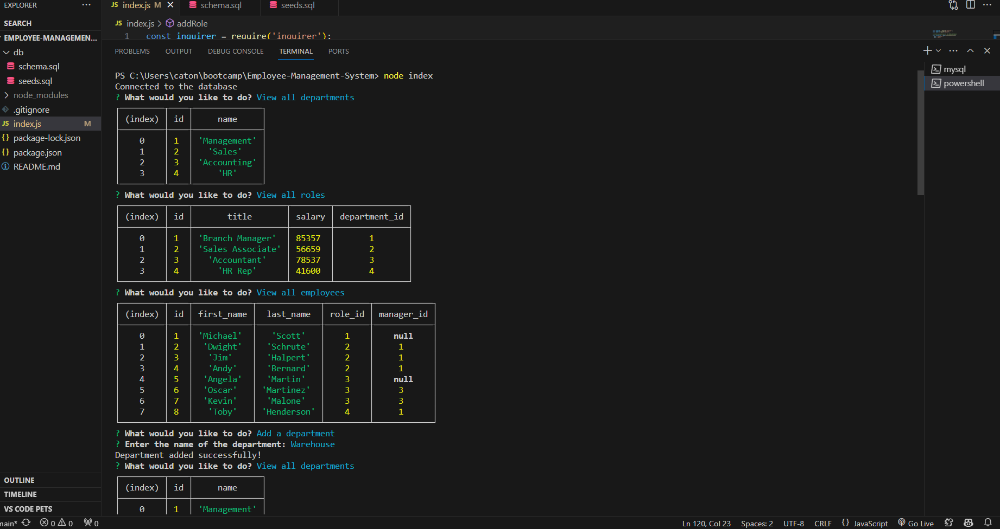
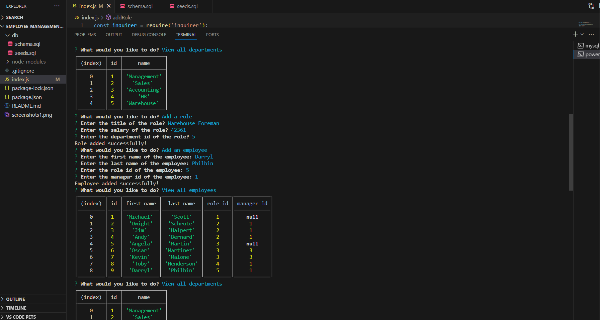
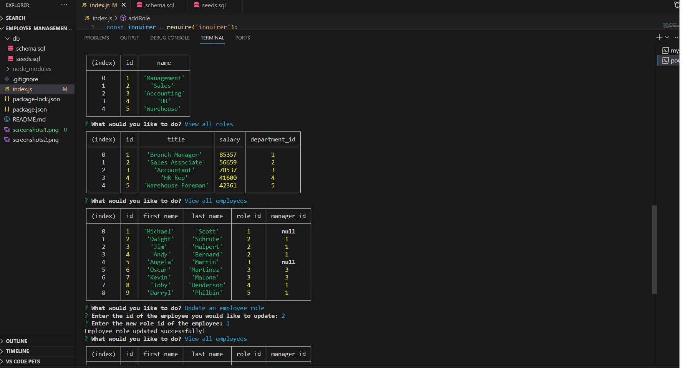
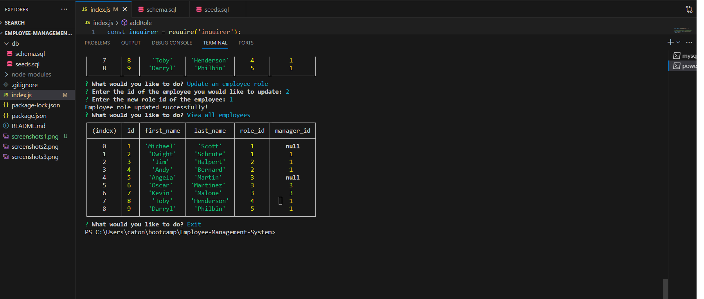

# Employee-Management-System

## Description
This command-line application allows business owners to view and manage departments, roles, and employees in their company. Users can perform actions such as viewing all departments, roles, and employees, adding new departments, roles, and employees, and updating an employee's role.

## Walk-Through Demo
https://drive.google.com/file/d/1EHoTY6poJF8PNGnKl0B8LmliKfzNoT1a/view

## Installation
1. Clone the repository to your local machine.
2. Navigate to the project directory.
3. Install dependencies using the following command:
 - **```bash**
 - **npm install**

 ## Usage
To run the application use the command: **node index**
Follow the prompts to perform various actions, such as viewing data or adding new records.

## Dependencies
- Inquirer.js
- mysql2

## Contributing
Contributions are welcome. Feel free to open an issue or submit a pull request.

## Questions
If you have any questions, please contact the project owner:
-GitHub: [Emily's GitHub](https://github.com/mLek10)
-E-Mail: [Emily's Email](caton.emily@yahoo.com)

## Screenshots



